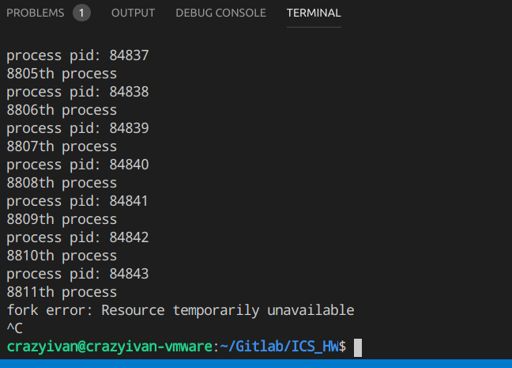

# Homework 07
CrazyIvanPro

[TOC]
## 1. Fork Bomb

+ Question: 构建程序，形成fork bomb，测试当前系统的普通用户可以创建的进程数量.

  

+ forkbomb.c

```c
#include <unistd.h>
#include <errno.h>
#include <string.h>
#include <stdio.h>

#define TRUE 1

int main()
{
	pid_t pid;
	int i = 0;
	while (TRUE)
	{
		if ((pid = fork()) == 0)
		{
			while (TRUE)
			{
				sleep(1);
			}
		}
		else if (pid < 0)
		{
			fprintf(stderr, "fork error: %s\n", strerror(errno));
			break;
		}
		printf("process pid: %d\n", pid);
		printf("%dth process\n", i++);
	}
	return 0;
}
```


+ OUTPUT
```bash
process pid: 84838
8806th process
process pid: 84839
8807th process
process pid: 84840
8808th process
process pid: 84841
8809th process
process pid: 84842
8810th process
process pid: 84843
8811th process
fork error: Resource temporarily unavailable
```




+ ulimit

  ```bash
  linux> ulimit -a
  ```

  ```c
  core file size          (blocks, -c) 0
  data seg size           (kbytes, -d) unlimited
  scheduling priority             (-e) 0
  file size               (blocks, -f) unlimited
  pending signals                 (-i) 23505
  max locked memory       (kbytes, -l) 16384
  max memory size         (kbytes, -m) unlimited
  open files                      (-n) 1024
  pipe size            (512 bytes, -p) 8
  POSIX message queues     (bytes, -q) 819200
  real-time priority              (-r) 0
  stack size              (kbytes, -s) 8192
  cpu time               (seconds, -t) unlimited
  max user processes              (-u) 23505
  virtual memory          (kbytes, -v) unlimited
  file locks                      (-x) unlimited
  ```

  + 用户最多创建 23505 个进程， 但实际只创建了8000~9000个进程，会有浮动。


+ 系统支持理论上限：
```bash
linux> cat /proc/sys/kernel/pid_max
```

```bash
131072
```


## 2. Nested Signal Handlers

+ Question: 构建程序，形成信号嵌套，并分别打印main函数和两个信号处理函数的rsp的值.

  

+ Nested Signal Handlers Program:

```c
#include "csapp.h"

#define TRUE 1

/* Function prototypes */
void sigint_handler(int sig);
void sigtstp_handler(int sig);

int main() {
    /* handlers */
	signal(SIGINT, sigint_handler);   /* ctrl-c */
	signal(SIGTSTP, sigtstp_handler); /* ctrl-z */
    
    unsigned long rsp;
    asm("\t mov %%rsp,%0" : "=r"(rsp));
    printf("main function rsp:\t%lx\n",rsp);
    
    while (TRUE) {
        printf("Wait for SIGTSTP...\n");
        sleep(1);
    }

    return 0;
}

void sigint_handler(int sig)
{
    
	int old_errno = errno; /* store errno */
	sigset_t mask_all, prev_all;
	
    /* mask all signals */
	sigfillset(&mask_all);
	sigprocmask(SIG_BLOCK, &mask_all, &prev_all);
    
    unsigned long rsp;
    asm("\t mov %%rsp,%0" : "=r"(rsp));
    printf("SIGINT handler rsp:\t%lx\n",rsp);

    /* restore all signals */
	sigprocmask(SIG_SETMASK, &prev_all, NULL);
	errno = old_errno; /* restore errno */
	_exit(0);
}

void sigtstp_handler(int sig)
{
    
	int old_errno = errno; /* store errno */
	sigset_t mask_all, prev_all;
	
    /* mask all signals */
	sigfillset(&mask_all);
	sigprocmask(SIG_BLOCK, &mask_all, &prev_all);
    
    unsigned long rsp;
    asm("\t mov %%rsp,%0" : "=r"(rsp));
    printf("SIGTSTP handler rsp:\t%lx\n",rsp);
    
    /* wait for sigint */
    printf("Wait for SIGINT...\n");    
    sigsuspend(&prev_all);

    /* restore all signals */
	sigprocmask(SIG_SETMASK, &prev_all, NULL);
	errno = old_errno; /* restore errno */
	return;
}
```


+ OUTPUT

```bash
main function rsp:      7fffb689ac30
Wait for SIGTSTP...
Wait for SIGTSTP...
Wait for SIGTSTP...
Wait for SIGTSTP...
Wait for SIGTSTP...
^ZSIGTSTP handler rsp:  7fffb689a400
Wait for SIGINT...
^CSIGINT handler rsp:   7fffb6899c00
```


